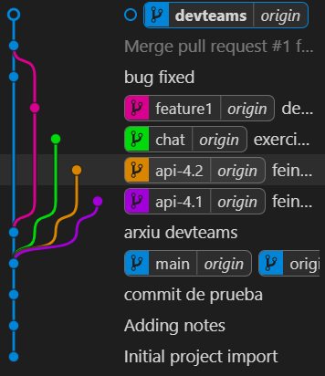
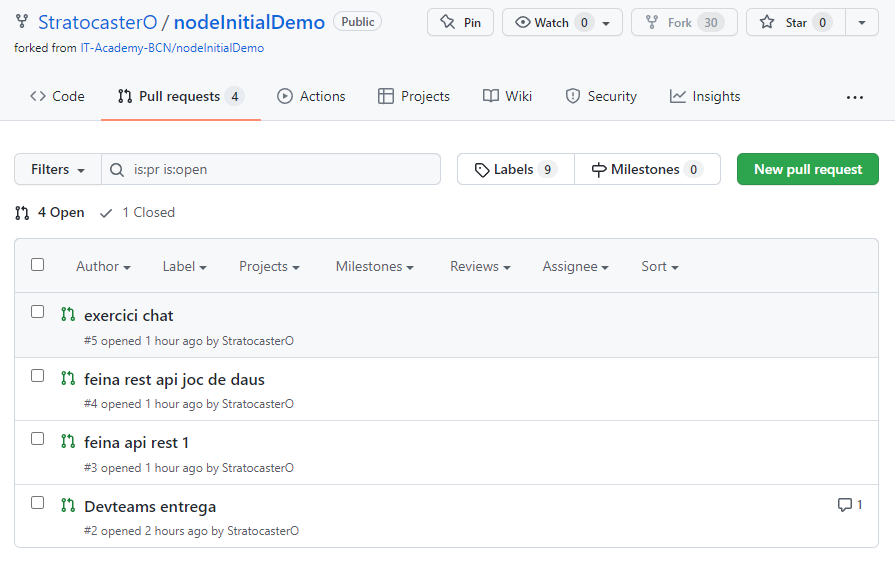

# Masterclass GIT avançat

Masterclass feta el 14 de març de 2022 per aprendre funcionalitats avançades de Git a l'itinerari de Node.js de la [IT Academy](https://www.barcelonactiva.cat/es/itacademy). Sobretot  orientada a les especialitzacions que tenen entregues mitjançant pull requests, però serà útil per tothom.

- Inicialització d'un repositori
- Sincronització del remot des de VSC
- Fork d'un altre repositori
- Branques de treball
- Pull requests al repo propi i a l'original

## Repositori de proves

Durant la classe hem fet tot el gitflow de les entregues de l'especialitat de Node al repo [nodeInitialDemo](https://github.com/StratocasterO/nodeInitialDemo/), un fork de l'[original de la IT Academy](https://github.com/IT-Academy-BCN/nodeInitialDemo).

Les branques han quedat així (visualitzades amb l'extensió de VSC [Git Graph](https://marketplace.visualstudio.com/items?itemName=mhutchie.git-graph)):

Les pull requests han quedat així:

## Repositori amb exercici de Git

En [aquest repositori](https://github.com/StratocasterO/node_git_initials) teniu instruccions per aprendre a fer un fork, clonar, modificar i fer pull request a un repositori col·laboratiu.

Si feu l'exercici, contacteu-me per discord perquè us accepti la pull request 😉

