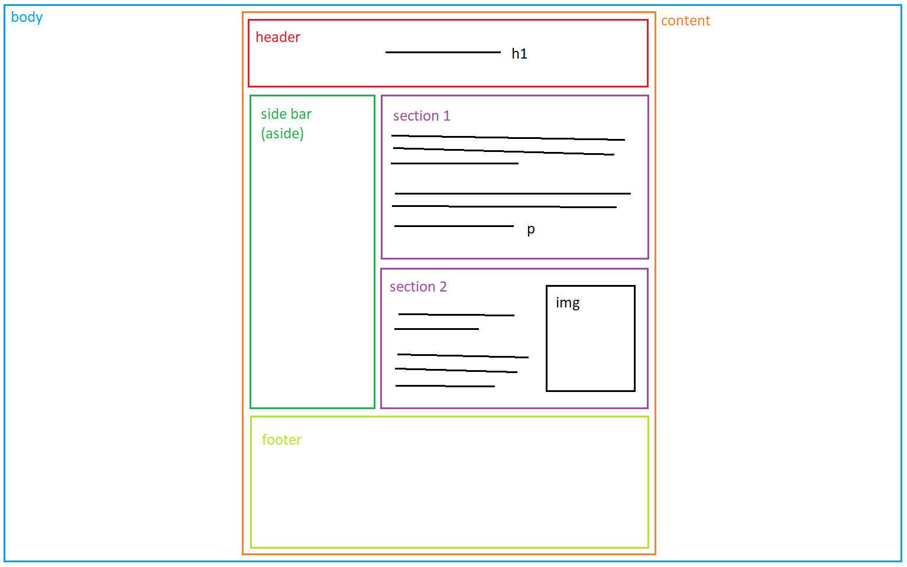
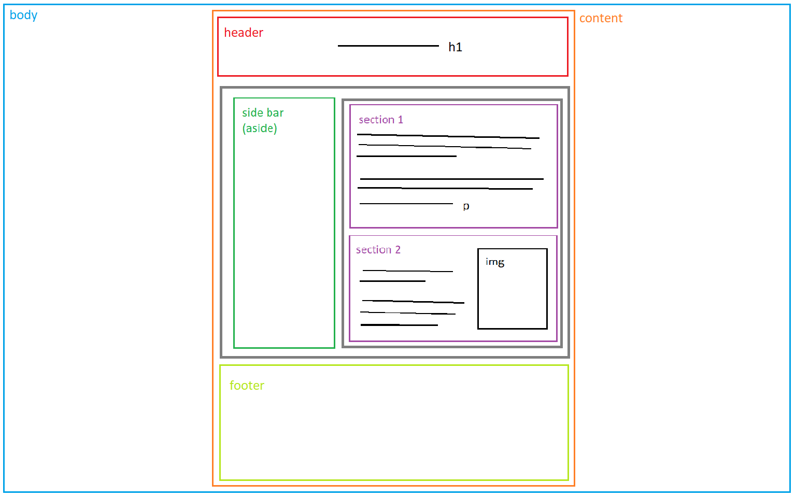

# Masterclass frontend basics

Masterclass sobre desenvolupament frontend (web) bàsic amb HTML, CSS i JS. Ens veiem a l'aula virtual de Node (https://bit.ly/3HOLgxU) o a l'aula INTERNET els que esteu presencialment. Masterclass realitzada per l'itinerari de Node.js de la [IT Academy](https://www.barcelonactiva.cat/es/itacademy).

## **HTML**

**H**yper**T**ext **M**arkup **L**anguage (HTML) és el llenguatge de marcat que interpreta el navegador (⚠ el navegador s'ho menja tot, no hi ha errors ni advertències).

[Aquí](index.html) l'arxiu de proves d'HTML on aniré editant coses.

### Etiquetes bàsiques:

- Títols `<h1></h1> ... <h6></h6>`
- Paràgrafs `

`
- Contenidors de text ``
- Enllaços `<a href="http://www.google.com">Google</a>`
- Contenidors `

`
- [Contenidors semàntics](https://www.w3schools.com/html/html5_semantic_elements.asp)
- Imatges `</img>`

### Formularis:

- Formulari `<form></form>`
- Text `<input type="text" placeholder="Text de prova">` <input type="text" placeholder="Text de prova">
- Botons `<input type="button" value="Clica aquí">` 
<input type="button" value="Clica aquí">
- Més inputs i labels: see [form.html](form.html)

### Estructura de caixes

⚠ Mai recolzar dues coses en una cosa

Una estructura així:

En realitats looks like això:

## **CSS**

**C**ascading **S**tyle **S**heets (CSS) es un llenguatge de disseny gràfic amb els que donem estils als elements d'HTML.

[Aquí](style.css) l'arxiu CSS on faré proves.

### Selectors

- Seleccionar tot `*`
- Etiquetes `body`, `p`, `div` 
- Classes `.nomdelaclasse`
- ID `#nomdelID`
- Element dins d'element `div p`
- [Altres selectors](https://www.w3schools.com/cssref/css_selectors.asp)

[CSS Dinner](https://flukeout.github.io/): joc per aprendre selectors de CSS

### Propietats

- `margin` (unitats: px, %, vw, vh, em, rem)
- `padding`
- `width`
- `height`
- `color`
- `font-size`
- `font-weight`
- `float: center/left/right`
- `position: relative/absolute/fixed/sticky` 
- `display: block/inline/inline-block`
- `display: flex`
- `display: grid`

### Display flex

[Flexbox froggy](https://flexboxfroggy.com/#es): joc per aprendre display flex

### Display grid

[Grid Garden](https://cssgridgarden.com/#es): joc per aprendre display grid

## **JavaScript**

Aquesta part ja la coneixeu: al JavaScript hi anirà tota la lògica del funcionament de la pàgina.

[Aquí](script.js) l'arxiu de JavaScript on aniré fent proves.

- `console.log()`
- `window.alert()`
- `window.prompt()`
- Modificació del DOM `querySelector()` i `querySelectorAll()`
- Disparadors `.addEventListener()`
- Per fer peticions HTTP al servidor: [Fetch API](https://pablomonteserin.com/curso/javascript/ejemplos-api-fetch/)
