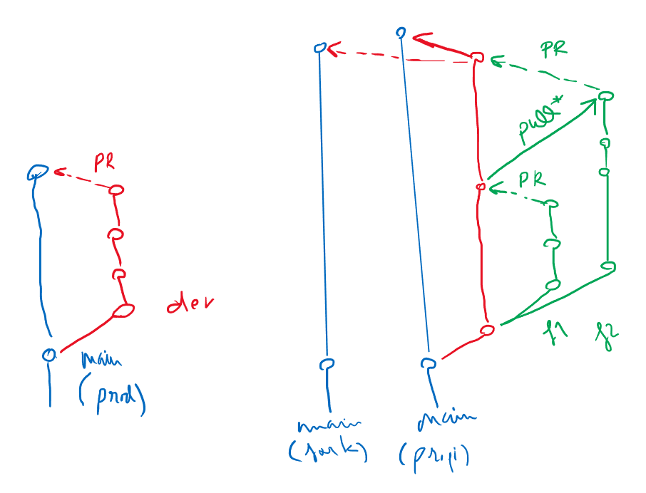

# Masterclass GIT 
Masterclass feta el 18 de gener per aprendre les **funcionalitats bàsiques i avançades de git** a l'itinerari de Node.js de la [IT Academy](https://www.barcelonactiva.cat/es/itacademy).

## Ús de GIT

Ús diari, còpia de seguretat, treball en diferents entorns, control de versions, compartimentització de les actualitzacions i _features_...

## Recomanacions generals

- Useu git des de VSC, us estalviareu problemes amb comandes incorrectes i no haureu de memoritzar comandes (també podeu usar alguna interfície gràfica com [Github Desktop](https://desktop.github.com/), [Git Kraken](https://www.gitkraken.com/), [Fork](https://git-fork.com/) o [Source Tree](https://www.sourcetreeapp.com/))
- Obriu al VSC **una única carpeta de treball** on tindreu clonats els vostres repos (⚠ compte amb tenir repos dins de repos, que no funciona ⚠)
- Configureu VSC perquè la terminal per defecte sigui la _Git Bash_, també us estalviarà problemes amb la __Power shell__ i sempre veureu en quina carpeta i branca esteu
- Manteniu el vostre GitHub ordenat: que tots els repos tinguin `README.md` i mantinguin el mateix format de nom, estructura, etc

## Funcionalitats comuns

Configuració:
- `git config --global user.name "John Doe"`
- `git config --global user.email "johndoe@example.com"`
- Credencials de Windows

Comandes:
- `git clone`
- `git add .`
- `git commit`
- `git pull`
- `git push`

## Ús des de VSC

Des de la pestanya _Source Control_ de VSC: molt més simple i sense haver de recordar comandes! ✨

- [Extensió Git Graph](https://marketplace.visualstudio.com/items?itemName=mhutchie.git-graph): per visualitzar l'arbre de Git del repositori i fer _checkout_ amb doble clic

## Creació d'un nou repo

Seguiu aquests pasos si us voleu estalviar maldecaps a l'hora d'inicialitzar repositoris.

La primera vegada:
- Afegir usuari i email per etiquetar els commits (si no ho heu fet encara, comandes més avall 👇🏻)
- Afegir credencials de GitHub fent el primer push per la terminal amb `git push origin` (segons la versió de Git i VSC ja no cal fer-ho per consola, funciona amb el botó `Sync changes 🔄`)

Un cop tingueu l'usuari i les credencials:
- Crear el repo a GitHub amb descripció, `README.md` i `.gitignore`, sel·leccionant el lenguatge que usareu
- Clonar el repo a VSC introduint la URL (o iniciant sessió al VSC amb el compte de GitHub), des del panell de Source Control o des de la paleta de comandes (`F1` o `CTRL + SHIFT + P`) amb la opció `Git: Clone`

## Ús diari

- Al arribar a un lloc de feina, fer `git pull` o `Sync changes 🔄` per obtenir els canvis fets a l'anterior lloc de feina
- Fer _commits_ durant el dia afegint els canvis al local. Els _commits_ han de ser significatius però freqüents (la creació d'una funció nova, un canvi important, un bug arreglat...), intenteu no fer _commit_ de moltíssims arxius alhora (excepte en la configuració d'un projecte nou, p.e.)
- Abans de marxar, fer `git push` o `Sync changes 🔄` per enviar els canvis al remot

## Gitflow

Branques _production_ i _staging_, branques per _features_ o per _developer_, documentació amb READMEs...

- Forks 
- `git branch`
- `git checkout`
- Pull requests (al teu i altres repos)

Aquí teniu un exemple de git flow simple:

I com ha quedat aquest esquema implementat en el [repo de prova](https://github.com/StratocasterO/git-flow) que hem fet sense branca `dev` i fent un canvi més a `exercici1` al final de tot:

Recordeu tornar al commit i/o la branca originals si heu de fer més d'un exercici usant la mateixa plantilla.

Feu les _pull requests_ des de GitHub al vostre repo o a un altre (si esteu treballant en un _fork_).

## Exercici _git_initials_

Repo: https://github.com/IT-Academy-BCN/node_git_initials

Seguiu les instruccions per fer l'exercici i practicar els conceptes de fork i pull-request 💪🏻

## Extres

- Visualitzador/simulador de GIT: teniu [aquest](https://git-school.github.io/visualizing-git/) o [aquest altre](https://learngitbranching.js.org/), que inclou tutorials